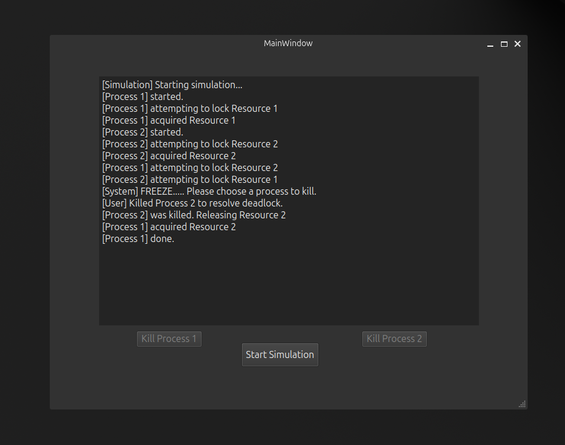

# Ostrich Algorithm Deadlock Simulator 🪶

A C++ & Qt GUI-based simulation of the **Ostrich Algorithm** — a strategy used by operating systems like Linux to **ignore deadlocks** unless they cause visible issues.

This project helps visualize how deadlocks occur, and lets users manually resolve them by "killing" one of the involved processes — just like system admins might in the real world.

## 🚀 Features

- Simulates 2 processes competing for 2 shared resources
- Introduces **circular wait** to create a deadlock condition
- Real-time **log output to GUI**
- Highlights **deadlock detection**
- Lets users manually resolve deadlock via:
  - 🔘 Kill Process 1
  - 🔘 Kill Process 2

## 🧠 What is the Ostrich Algorithm?

> *"If you don't look at the problem, maybe it doesn't exist..."*

The Ostrich Algorithm is a deadlock-handling strategy where the OS simply **ignores the possibility of deadlocks** under the assumption they are rare — relying on **manual intervention** if something goes wrong.

This project simulates that philosophy!

## 🖥️ GUI Preview

## 🛠 Built With

- **C++17**
- **Qt 6 Widgets**
- Multithreading (`std::thread`)
- Signals/slots for safe UI updates

